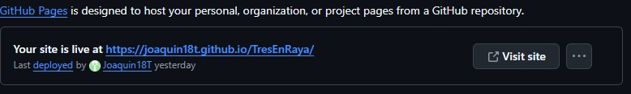

## PASOS PARA DESPLEGAR TU APP EN GITHUB PAGE
>[!NOTE]
Primero crea un repositorio.

**Paso 1:**  Instalar en el proyecto `gh-pages`. Es un paquete que facilita subir  tu aplicacion en Github Pages.

`npm install gh-pages --save-dev`

**Paso 2:** Configurar en el archivo package.json, en la seccion de *scripts*, agregar las siguientes lineas.

```
"predeploy": "npm run build"
"deploy": "gh-pages -d build"
```

>[!NOTE]
Si usas el empaquetador de [Vite](https://vite.dev/), en vez de `gh-pages -d build` cambia el build por el nombre **dist**. Esto es debido a que con Vite te crea una carpeta dist ya que lo usa como una carpeta de salida predeterminada para archivos construidos.

**Paso 3:** En la parte superior del mismo archivo, debajo de la propiedad **private**, agregar la propiedad **homepage** con la URL del repositorio creado.

```
"homepage": "https://tu-usuario.github.io/nombre-del-repositorio"
```

**Paso 4:**  Inicializar el repositorio de tu proyecto.
```
git init
git add .
git commit -m "first commit"
```

**Paso 5:** Conectar tu proyecto local con el repositorio remoto

```
git remote add origin https://github.com/tu-usuario/nombre-del-repositorio.git
```

**Paso 6:** En el archivo (si usas el enpaquetador vite) vite.config.js, agregar la propiedad **base** con el nombre de tu repositorio (debajo de la primera propiedad).

`base:"/nombre-repositorio/"`


**Paso 7:** Si tu proyecto esta routeado, entonces en el componente **BrowserRouter**, agregar la propiedad **basename** con el nombre de tu repositorio. Si no, salte este paso.

`<BrowserRouter basename="/nombre-repositorio"...`

**Paso 8:** Debido a **GitHub Pages no admite rutas del lado del cliente de forma nativa**, si no se configura Github Pages devolvera un error 404. Para ello hay que crear un archivo 404.html en la carpeta public con el siguiente codigo

```
<!DOCTYPE html>
<html>
  <head>
    <meta charset="utf-8" />
    <title>React Router</title>
    <script type="text/javascript">
      var pathSegmentsToKeep = 1;

      var l = window.location;
      l.replace(
        l.protocol +
          "//" +
          l.hostname +
          (l.port ? ":" + l.port : "") +
          l.pathname
            .split("/")
            .slice(0, 1 + pathSegmentsToKeep)
            .join("/") +
          "/?/" +
          l.pathname.slice(1).split("/").slice(pathSegmentsToKeep).join("/").replace(/&/g, "~and~") +
          (l.search ? "&" + l.search.slice(1).replace(/&/g, "~and~") : "") +
          l.hash
      );
    </script>
  </head>
  <body></body>
</html>
```

**Paso 9:** Agregar el siguiente script al archivo **index.html**. Sirve para que muestre la vista cuando se ingresa a una ruta desconocida

```
<script type="text/javascript">
  (function (l) {
    if (l.search[1] === "/") {
      var decoded = l.search
        .slice(1)
        .split("&")
        .map(function (s) {
          return s.replace(/~and~/g, "&");
        })
        .join("?");
      window.history.replaceState(null, null, l.pathname.slice(0, -1) + decoded + l.hash);
    }
  })(window.location);
</script>
```

**Paso 10:** Subir tu codigo al repositorio remoto.

```
git branch -M main
git push -u origin main
```

**Paso 11:** Ahora se despliega el proyecto con los siguientes comandos.

`npm run build`
Construye tu aplicacion

`npm run deploy`
Despliega tu aplicacion

**Paso 12:** Una vez usado los comandos anteriores, ir a **actions** del repositorio y ver el workflow este con un check en verde (Si esta en amarillo, quiere decir que esta cargando). Si no te aparece esto, espera. Tarda un poco.

Si esta con un check, ahora dirigete a **settings** y seleccionar la opcion de pages. Aca tendra que visualizar que la rama es `gh-pages` y la carpeta sea `root`. Si no lo tienes, seleccionalo y click en save. Con esto debe aparecerte un link al inicio de la vista.



